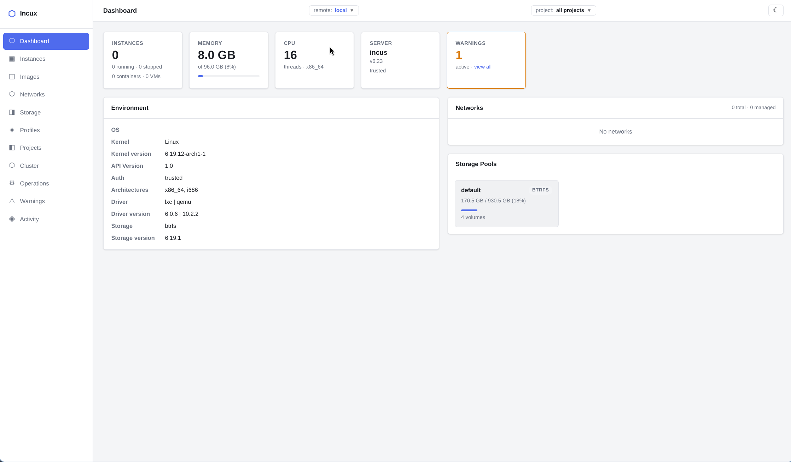

# Incux



Incux is a self-contained web UI for managing Incus (Linux container/VM hypervisor) environments. A single Go binary serves the frontend and proxies all API calls to one or more Incus servers — local or remote.

---

## Tech Stack

- **Backend**: Go, standard library only, static binary, embeds frontend at compile time
- **Frontend**: SolidJS + TypeScript, built with Vite
- **Communication**: Go reverse-proxies REST calls to Incus; WebSocket connections are tunnelled via raw TCP hijacking (preserving Upgrade/Connection headers and injecting Sec-WebSocket-Protocol echo for SPICE)

---

## Features

1. **Dashboard** - overview page
2. **Instances** - list, launch, start/stop/restart/freeze/delete instances
   - Live IPv4 display (recursion=2)
   - Detail drawer with config, network, memory
   - Live performance panel (CPU %, memory bar, network rates, disk, process count) — polls every 2s
   - **Console (TTY)** - attaches to persistent instance TTY via `/console` endpoint; auto-reconnects every 3s on disconnect
   - **Shell (exec)** - spawns fresh bash shell via `/exec` endpoint
   - **VGA console** - opens in a pop-out window, uses SPICE protocol via spice-html5, auto-reconnects after reboot
3. **Images** - list images, launch instances from images
4. **Networks** - list and manage networks
5. **Storage** - list storage pools and volumes
6. **Profiles** - list and manage profiles
7. **Snapshots** - create, list, and restore instance snapshots
8. **Backups** - create and download instance backups
9. **Copy/Migrate Instances** - copy or migrate instances between remotes
10. **Files** - file browser for managing instance files
11. **Metadata Editing** - edit instance metadata
12. **Read-Only Mode** - non-admin users have restricted access
13. **Light/dark theme** toggle, persisted to localStorage

---

## Backend Details

- `main.go` - entry point, embeds `frontend/dist`, listens on `:8080`
- `routes.go` - registers all `/api/1.0/*` proxy routes + SPA fallback
- `proxy.go` - reverse proxy for regular HTTP; raw TCP tunnel for WebSocket upgrades (handles `Sec-WebSocket-Protocol` injection for SPICE)
- `intercept.go` - intercepts `POST /api/1.0/instances` to auto-resolve image aliases to `images.linuxcontainers.org` if not found locally
- `logger.go` - middleware that logs every action on Incus objects (instances, images, networks, storage-pools, profiles, cluster)
- `rbac.go` - RBAC middleware — enforces admin role requirement for write operations
- `/whoami` - returns the authenticated user as JSON

---

## Frontend Details

- `src/index.tsx` - router, theme management; `/instances/:name/vga` route bypasses Layout
- `src/pages/Instances.tsx` - main instances page with all console/perf features
- `src/pages/VgaConsole.tsx` - full-page SPICE console with auto-reconnect
- `src/components/InstanceConsole.tsx` - xterm.js terminal (console + exec modes)
- `src/components/InstancePerf.tsx` - live performance metrics component
- `src/components/Drawer.tsx` - slide-out panel used across all pages
- `src/api.ts` - all API calls typed with TypeScript interfaces

---

## Environment Variables

- `INCUS_ADDR` - upstream Incus address (default: `unix:///var/lib/incus/unix.socket`). Supports `unix://`, `http://`, `https://` schemes.

---

## Authentication

1. Authentication is disabled by default.
2. `AUTH_DISABLED=true` — explicitly disables authentication (useful to be explicit).
3. **Teleport JWT Authentication**:
   - Set `TELEPORT_JWKS_URL` to enable Teleport JWT authentication.
   - Optional environment variables:
     - `TELEPORT_AUDIENCE`
     - `TELEPORT_INSECURE=true`
4. The `/whoami` endpoint returns the authenticated user as JSON.
5. When authenticated, the username appears in the topbar.
6. To add new authentication mechanisms:
   - Implement the `Authenticator` interface in a new file.
   - Add a branch to `newAuthenticator()` in `backend/auth.go`.

### RBAC

- When authentication is enabled:
  - Users with the role `admin` have full access.
  - All other authenticated users are read-only (GET/HEAD/OPTIONS requests pass through, while mutations are blocked with a 403 error).
  - The frontend hides write controls for read-only users.
- When authentication is disabled, all access is unrestricted.

---

## Build & Run

```bash
make all       # build frontend + backend (runs `go build .` from the repo root)
make run       # run the binary
make clean     # remove dist/
make test      # run all tests
```

The binary is output to `./dist/<os>-<arch>/incux`. The frontend is embedded in the binary via Go's `//go:embed`.

---

## Testing

- `make test` — runs both backend and frontend tests
- `make test-backend` — Go tests (`go test ./...`)
- `make test-frontend` — frontend tests (`npm test` in `frontend/`)
- Backend tests cover RBAC middleware and JWT authentication logic.
- Frontend tests cover utility functions in `api.ts` (e.g., `fmtBytes`, `fmtDate`, `baseForRemote`).

---

## Requirements

- Go 1.21+
- Node.js 18+ / npm
- Incus installed and running on the host **or** a remote Incus server (see below)

---

## Remote-Only Usage (no local Incus required)

Incux can manage remote Incus servers without a local Incus installation. The binary itself has no dependency on Incus — it only needs a valid Incus client configuration to know where to connect and how to authenticate.

### What you need

- `~/.config/incus/config.yml` — lists your remote servers
- `~/.config/incus/client.crt` — client certificate presented to Incus for mTLS auth
- `~/.config/incus/client.key` — corresponding private key

When the local unix socket is absent and `INCUS_ADDR` is not set, the `local` remote is automatically omitted and the UI selects the first configured remote on startup.

### Easiest setup: install only the Incus client

You do not need to run a full Incus daemon. Installing just the client tools gives you `incus remote add` to configure and authenticate against remote servers:

```bash
# Debian / Ubuntu
sudo apt install incus-client

# or via the Zabbly repository for the latest release:
# https://github.com/zabbly/incus
```

Then add your remote:

```bash
incus remote add myserver https://my-incus-host:8443
```

This creates `~/.config/incus/config.yml` and generates `client.crt` / `client.key` automatically. The remote Incus server will prompt you to trust the new client certificate (run `incus config trust add-certificate` on the server, or accept via the server's UI).

If running Incux as a dedicated service account (e.g. `incux`), place the config in that user's home directory:

```
/var/lib/incux/.config/incus/config.yml
/var/lib/incux/.config/incus/client.crt
/var/lib/incux/.config/incus/client.key
```

---

## VGA Console Notes

- VM-only (containers don't have VGA)
- Requires SPICE display device (Incus VMs get this by default)
- Auto-reconnects every 3s after disconnection/reboot